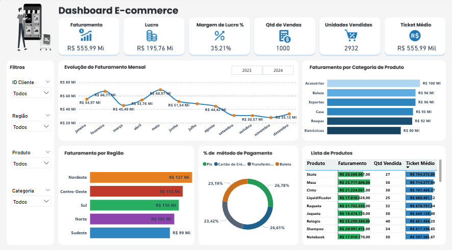

# Dashboard-Ecommerce
Dashboard de E-commerce no Power BI | Protótipo no Figma e análise final com indicadores de faturamento, lucro e vendas
# 🛒 Dashboard E-commerce

## 📌 Descrição
Este projeto apresenta um **Dashboard de E-commerce** desenvolvido no **Power BI**, a partir de uma **prototipação no Figma**.  

O objetivo foi aplicar boas práticas de **design de dashboards** e transformar a ideia inicial em um produto final no Power BI, com foco em **faturamento, lucro, ticket médio, vendas e análise por categoria, região e produto**.

---

## 🖼️ Prints do Projeto

### 🎨 Protótipo no Figma

### 📊 Dashboard Final no Power BI

---

## 📊 Análises e Insights

- **Faturamento total:** R$ 555,99 milhões  
- **Lucro líquido:** R$ 195,76 milhões (**margem de 35,21%**)  
- **Ticket médio por pedido:** R$ 555,99 mil → negócio voltado para produtos premium  

### 📍 Destaques por região
- **Nordeste** liderou em faturamento com R$ 127 milhões  
- **Sudeste** teve R$ 99 milhões → mostra espaço para expansão  

### 🏷️ Categorias
1. Acessórios  
2. Beleza  
3. Esportes  
4. Casa  
5. Roupas  
6. Eletrônicos  

### 📅 Tendência mensal
- Picos de vendas em **fevereiro** e **maio**  
- **Dezembro** apresentou queda → campanhas de fim de ano poderiam ser fortalecidas  

---

> 🚀 **Conclusão:** este projeto mostra que análise de dados não é apenas construir gráficos bonitos, mas **interpretar padrões e gerar insights que podem direcionar decisões reais**.

---

## 🛠️ Tecnologias Utilizadas
- **Figma** – prototipação inicial do dashboard  
- **Power BI** – desenvolvimento final e visualizações interativas  
- **GitHub** – versionamento e portfólio  

---

## 👨‍💻 Autor
[Alex Sanches](https://www.linkedin.com/in/alexsanches-dados)  
*Analista de Dados em transição de carreira | Excel • SQL • Power BI*
